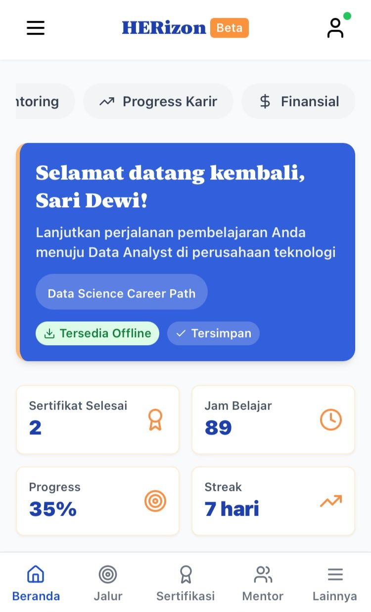
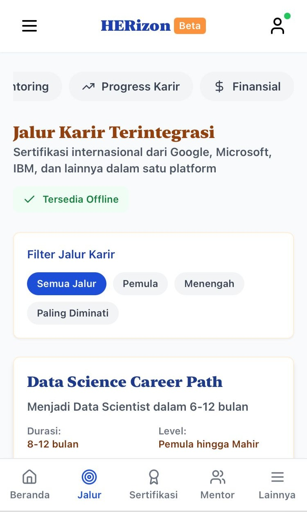
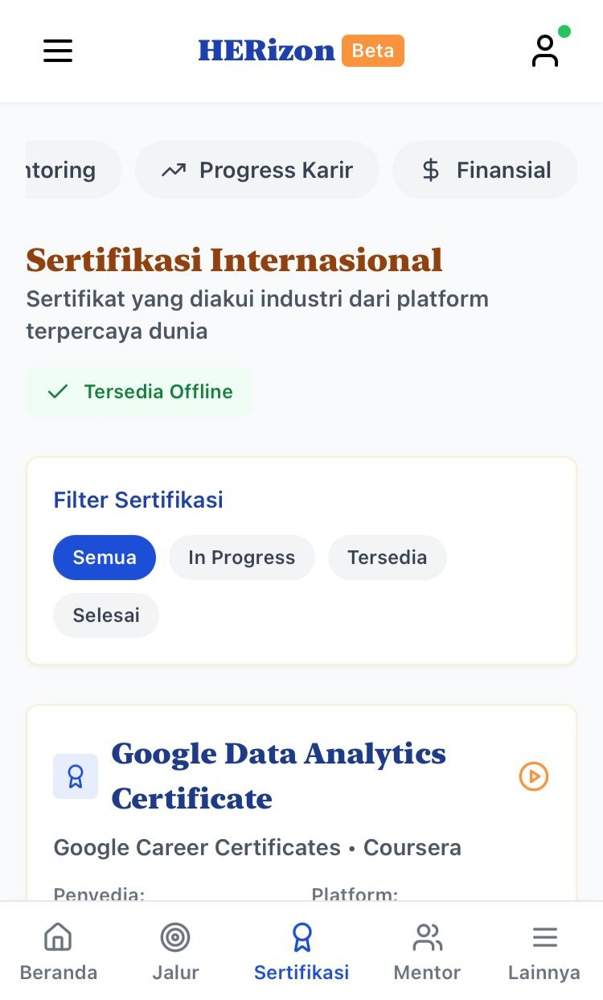
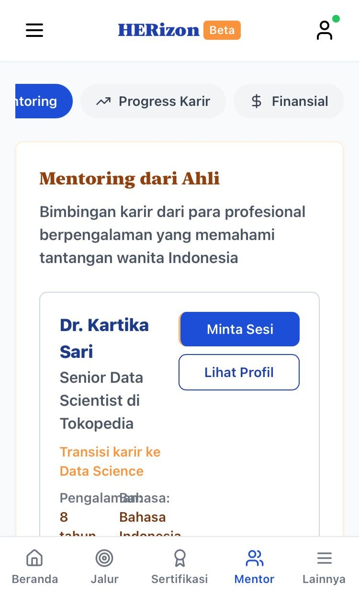
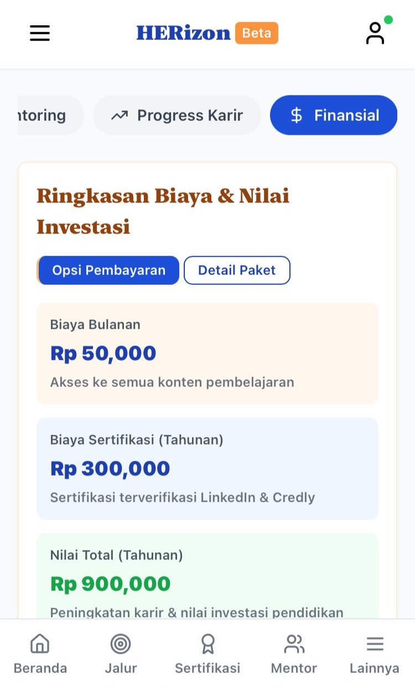

 

## Platform Karir Wanita di Tech
A comprehensive career development platform designed specifically for Indonesian women in technology fields, with special focus on working mothers and single parents. HERizon provides mentorship, flexible learning paths, international certifications, and community connection to help women thrive in tech careers while balancing family responsibilities.

## 🌟 Features
### 📊 Dashboard
- Personalized welcome with career goal tracking
- Learning progress visualization with offline access
- Quick stats on certifications, study hours, and streak
- Upcoming events with one-click registration
- Offline content downloading for learning without internet

### 🏆 Certifications
- International certifications from Google, Microsoft, IBM and more
- Mobile-optimized certification cards with enhanced visual hierarchy
- Progress tracking for ongoing certifications
- Advanced filter controls for certification status
- Individual certification offline download capability
- Batch download option for all certifications
- Badge verification with LinkedIn and Credly integration
- Responsive certification search with intelligent suggestions
- Touch-friendly interface with smooth animations

### 📚 Career Paths
- Integrated career paths with international certifications
- Mobile-optimized learning interface with improved touch targets
- Enhanced filter options for skill level and industry demand
- Individual path offline download capability
- Responsive visual layout with proper spacing for mobile devices
- Career progress tracking with animated progress bars
- Popular paths include:
  - Data Science Career Path
  - UI/UX Design Career Path
  - IT Support Specialist Path

### 💚 Wellness Hub
- 24/7 anonymous counseling chat
- Stress management tools and meditation guides
- Working mom support groups
- Health education resources (reproductive health, nutrition, self-care)

### 👶 Childcare Support Network
- *Emergency Childcare Fund:* Financial assistance for interviews, classes, or work
- *Childcare Exchange:* Trade childcare hours with other parents
- *Event Childcare:* Free childcare during workshops and community events

### 🌐 Community Features
- Forums for sharing experiences and getting support
- Regional meetups with childcare provided
- Professional networking opportunities
- Resource sharing and collaboration

### 💼 Career Opportunities
- Curated job board with family-friendly positions
- Flexible and remote work opportunities
- Internship programs designed for career returners

### 📖 Resources & Tools
- Educational materials and guides
- Financial aid information
- Practical tools for career development
- STEM education resources for children

### 🛠️ Technology Stack
- Frontend: React with Hooks (useState, useEffect, useRef)
- Styling: Tailwind CSS with custom animations and transitions
- Icons: Lucide React for consistent visual language
- Responsive Design: Mobile-first approach with offline capabilities
- Animations: Custom CSS transitions for improved UX
- Progressive Web App: Offline functionality and local caching

### 🚀 Recent Enhancements
- **Mobile Optimization**: Touch-friendly interface elements throughout the app
- **Responsive Headers**: Adaptive layouts for all screen sizes 
- **Offline Capabilities**: Download content for use without internet connection
- **Visual Hierarchy**: Improved for better readability on small screens
- **Animations & Transitions**: Smooth feedback for user interactions
- **Touch Targets**: Enlarged for better mobile usability
- **Download Manager**: Individual and batch download options for learning materials

# 🚀 Getting Started
## Prerequisites
- Node.js (v14 or higher)
- npm or yarn package manager

## Installation

1. Clone the repository:
```
git clone https://github.com/yourusername/horizon-tech.git
cd horizon-tech
```
2. Install dependencies:
```
npm install
```
3. Install required packages:
```
npm install react lucide-react
```
4. Start the development server:
```
npm start
```

5. Open your browser and navigate to http://localhost:3000

## Mobile Testing
For the best mobile experience:
1. Use Chrome DevTools (F12) and toggle device toolbar
2. Select various mobile devices to test responsive design
3. Enable throttling to test offline capabilities
4. Test touch interactions and animations

## Offline Functionality
HERizon supports offline access through:
- Local content caching
- Downloadable learning materials
- Service worker integration (in progress)
- Offline-first UX patterns

### Feature Requests
- Focus on features that support working mothers in STEM
- Consider childcare integration for all interactive features
- Prioritize accessibility and inclusivity with mobile optimization
- Maintain the supportive, community-focused tone

## 🎯 Target Audience
### Primary Users:
- Women in STEM fields
- Working mothers in technology, science, engineering, and mathematics
- Single parents pursuing STEM careers
- Women returning to STEM careers after breaks
- STEM students balancing family responsibilities

### Key Pain Points Addressed:
- Lack of flexible learning options
- Limited mentorship opportunities
- Childcare barriers to professional development
- Isolation in male-dominated fields
- Work-life balance challenges
- Career advancement obstacles

### 🌍 Social Impact
HERizon aims to:
- Increase retention of women in STEM fields
- Support working mothers' career advancement through flexible, mobile learning
- Provide accessible education and professional development regardless of internet connectivity
- Build supportive communities for underrepresented groups
- Bridge the digital divide through mobile-first and offline-capable design
- Address systemic barriers through practical tech solutions
- Empower women with limited time through efficient, touch-friendly interfaces

# Screenshots of the App
## Dashboard

## Career Paths

## Certifications

## Mentorship

## Financial Planning



# "Empowering women in tech, anytime and anywhere." 💜
# HERizon - Where innovation meets opportunity, online or offline.
